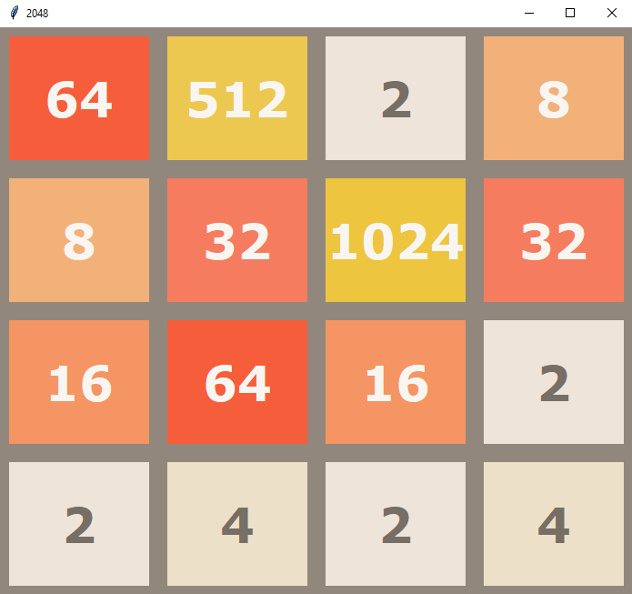

# 2048 DQN

Deep Q learning agent playing 2048




### Prerequisites

- python 3.6

It's recommended to use conda
```
conda create --name tf-cpu tensorflow python=3.6
```
or gpu version:
```
conda create --name tf-gpu tensorflow-gpu
```
```
conda install --file requirements.txt
pip3 install recordclass
```
You may also use pure pip:
```
pip3 install -r requirements.txt
pip3 install recordclass
```

You may have to manually install python3-tk for tkinter library on linux

## Usage

Use training_cli.py script to:
- train random or specific agent configuration
- render the game while training
- find agent with maximum average score
- watch best agent play

```
python3 training_cli.py --help
```

## Description

Implementation of deep q learning agent for playing 2048 game


## Results

Each agent is evaluated by playing 25000 steps of the game

Best agent goes up to 2804 sum of tiles and max 2048 tile with average sum on board ~1100

Max tile of random agent is 256 with average sum on board equal 250

## Directory names meaning

ill0_em015_Adamax_mae_256_256_256_linear_batch_8_tUpdF100_learnF30_div_by_max_ddq_1_trm_epsC10000_RMDC1000000_dry1

ill0 - don't allow illegal moves  
em015 - minimum eps = 0.15  
Adamax - neural network optimizer  
256_256_256 - sizes of each fully connected deep layer  
linear - output activation function  
batch_8 - number of memory samples in each training  
tUpdF100 - update target network (double q learning) each 100 trainings  
learnF30 - train each 30 steps in game  
div_by_max - state mapping function, this one divides all tiles by current max  
ddq_1 - use double q learning  
trm - type of rewarding function, time reward minus (see helper_functions.py for details)  
epsC10000 - epsilon constant (used in )  
RMDC1000000 - type of replay memory, Replay Memory Dynamic Crucial with 1e6 max capacity  
dry1 - dry training mode, in each state test and remember outcomes from all moves  